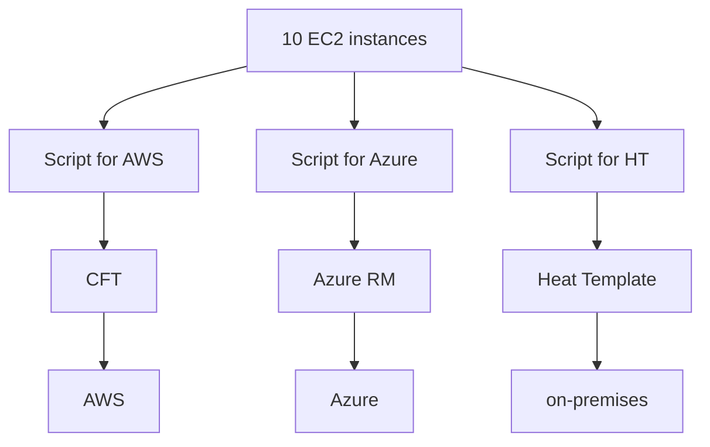
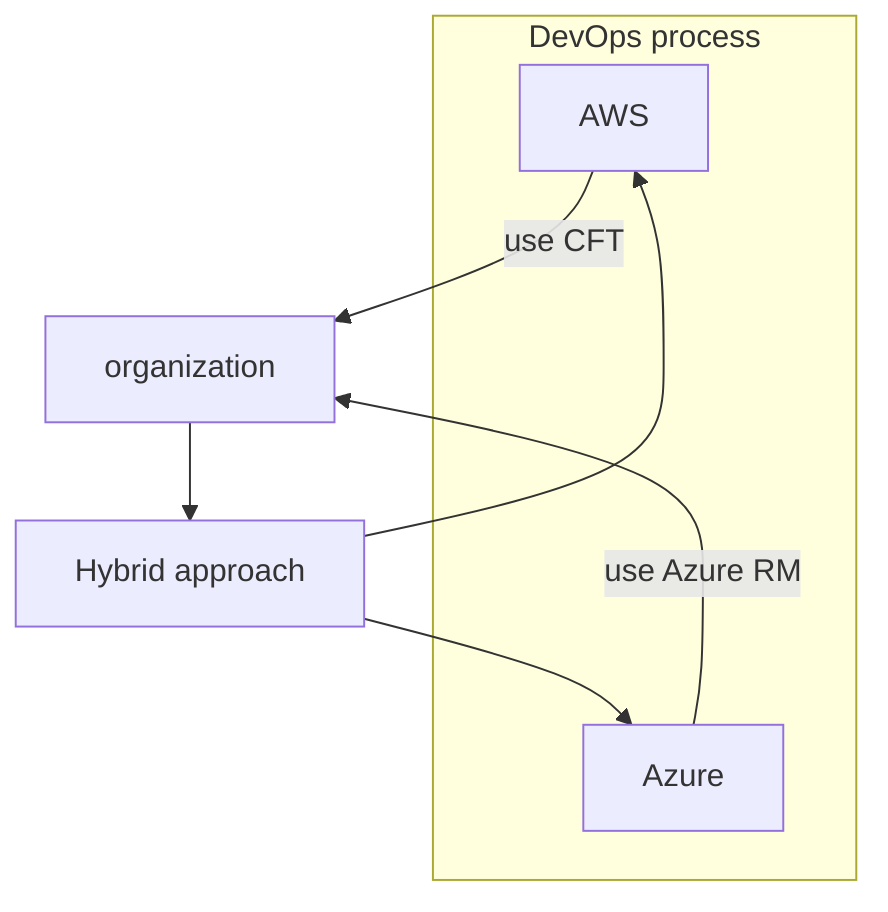

## Infrastructure as Code (IaC)

> To automate the process of resource creation in cloud/physical platforms.

### Problem — Platform-Specific Scripts

So, every time we need to change platforms, we use scripts based on the platforms. For migration, it takes so much time.

### DevOps Hybrid Approach

Instead of using different IaC tools to create resources each time, we use a common tool — **"Terraform"**.

---
