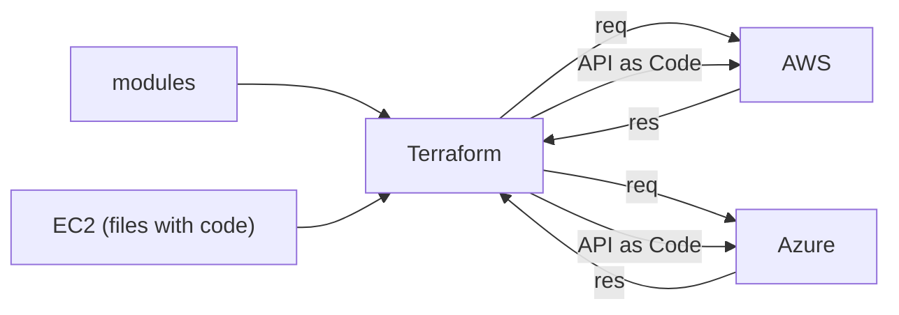

## Terraform (IaC)

In Terraform, the **templating language is the same for all platforms**.

- **API as Code** (Works based on API)
  - `provider.tf` file talks to the API of AWS/Azure and converts scripts to readable API.
- We can write scripts in Terraform to create resources in **AWS / Azure / GCP**.
- We can switch from AWS → Azure / GCP with **minimal changes** in code.

> **API** ⇒ Talks to an application using a programmatic way, i.e., the request & response.

### Terraform API-as-Code Flow

---