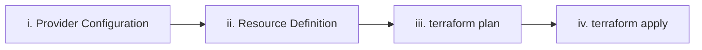

## Four Major Steps

| Step | Action | Description |
|------|--------|-------------|
| i | Provider configuration | Define the cloud provider |
| ii | Resource definition | Define what resources to create |
| iii | `terraform plan` | Makes a plan about what exists & what needs to be done |
| iv | `terraform apply` | Creates the actual resources |

---