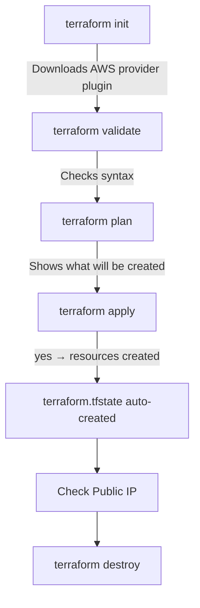

## Step-by-Step: Create EC2 Instance

### Step 1 — Create Project Folder

```bash
mkdir terraform
cd terraform
```

### Step 2 — Create Required Files

```bash
touch main.tf variables.tf outputs.tf terraform.tfvars
```

### Step 3 — Write Provider Configuration

**`main.tf` — Provider Block:**

```hcl
provider "aws" {
  region = var.region
}

terraform {
  required_providers {
    aws = {
      source  = "hashicorp/aws"
      version = "~> 4.16"
    }
  }
  required_version = ">= 1.2.0"
}
```

**`main.tf` — Resource Block:**

```hcl
resource "aws_instance" "my-ec2" {
  ami           = var.ami_id
  instance_type = var.instance_type

  tags = {
    Name = "Terraform-EC2"
  }
}
```

> - Terraform internal name → `my-ec2`
> - Resource name in AWS → `Terraform-EC2`

---

### Step 4 — Define Variables

**`variables.tf`:**

```hcl
variable "region" {
  description = "AWS region"
  type        = string
}

variable "ami_id" {
  description = "AMI ID for EC2"
  type        = string
}

variable "instance_type" {
  description = "EC2 instance type"
  type        = string
}
```

---

### Step 5 — Provide Variable Values

**`terraform.tfvars`:**

```hcl
region        = "ap-south-1"
ami_id        = "ami-0f5ee92e2db3afc18"   # Amazon Linux 2
instance_type = "t2.micro"
```

---

### Step 6 — Output EC2 Public IP

**`outputs.tf`:**

```hcl
output "public_ip" {
  value = aws_instance.my-ec2.public_ip
}
```

---

## Execution Process



| Step | Command | Description |
|------|---------|-------------|
| 1 | `terraform init` | Downloads AWS provider plugin |
| 2 | `terraform validate` | Checks syntax |
| 3 | `terraform plan` | Shows `+ create aws_instance.my-ec2` |
| 4 | `terraform apply` → yes | Creates resources; `terraform.tfstate` auto-created |
| 5 | Check public IP | Verify instance is running |
| 6 | `terraform destroy` → yes | Destroys all resources |
| 7 | `terraform import` | Import existing resources using their resource ID & specify where to go |

---

## GitHub & .gitignore

Add the following to `.gitignore`:

```
.terraform/
terraform.tfstate
terraform.tfstate.backup
```

---
