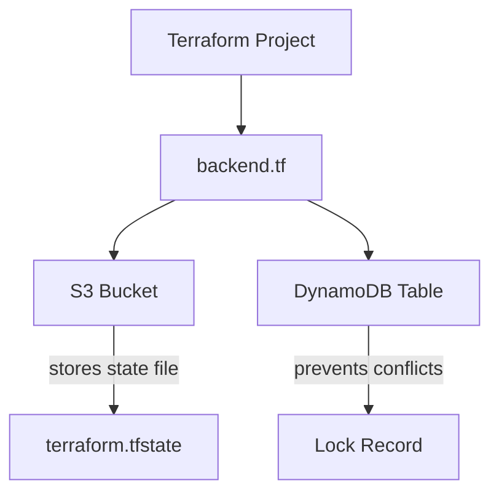
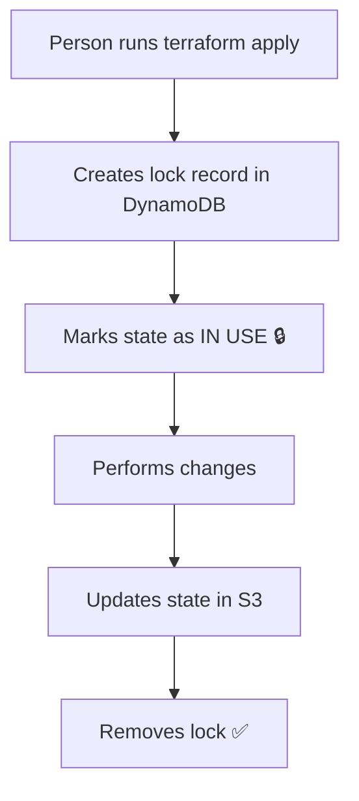

## Remote State Backend



### Remote State Setup

```
S3 bucket   =>  versioning
DynamoDB    =>  locking
```

### Console Setup Steps

**1. Create S3 Bucket**

| Setting | Value |
|---------|-------|
| Name | `s3-bucket` |
| Region | `ap-south-1` |
| Versioning | ✅ Enabled |
| Default encryption | ✅ Enabled |
| Block public access | ✅ Enabled |

**2. Create DynamoDB Table (for locking)**

| Setting | Value |
|---------|-------|
| Name | `lock-table` |
| Partition Key | `LockID` (String) |

**3. Add Backend Configuration**

Inside the Terraform project folder:

```bash
vim backend.tf
```

```hcl
terraform {
  backend "s3" {
    bucket         = "s3-bucket"
    key            = "dev/terraform.tfstate"   # path inside bucket
    region         = "ap-south-1"
    dynamodb_table = "lock-table"
    encrypt        = true
  }
}
```

**4. Reinitialize Terraform**

```bash
terraform init
# Do you want to copy existing state to new backend? → yes
```

---

### State Management Commands

| Command | Description |
|---------|-------------|
| `terraform state list` | Shows all resources in state |
| `terraform state pull` | Prints full state in terminal |
| `terraform state pull > state.json` | Saves state to a file |
| `terraform state show aws_instance.my_ec2` | View a specific resource |

---

### Creating S3 & DynamoDB Using Terraform (Instead of Console)

1. Create a **separate project** to provision the S3 bucket & DynamoDB table using Terraform.
2. Use those resource IDs inside `backend.tf` of the main project.
3. Run `terraform init` in the main project.

---

## DynamoDB Locking

> Protects Terraform state when **two people modify at the same time**.



### Why DynamoDB?

| Feature | Benefit |
|---------|---------|
| Highly available | No single point of failure |
| Fast | Low latency locking |
| Supports conditional writes | Safe concurrent access |
| Fully managed NoSQL DB | No infra management needed |
| Serverless | Scales automatically |

---
