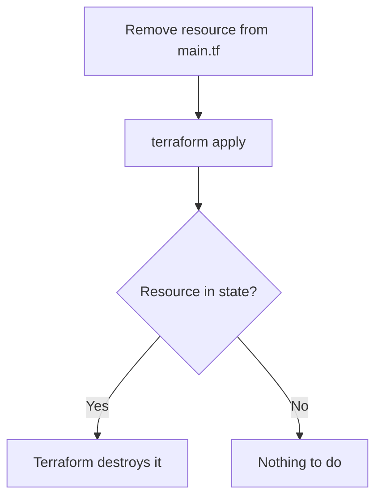

## Deleting Resources

> Resources are stored in the **state file of each project folder**.

| Method | Command | Description |
|--------|---------|-------------|
| Destroy all | `terraform destroy` | Destroys everything in state |
| Destroy specific | `terraform destroy -target=<resource_name_in_tf>` | Destroys a specific resource |
| Implicit destroy | Remove resource from `main.tf` → run `terraform apply` | Resource exists in state but not in code → Terraform destroys it |

---